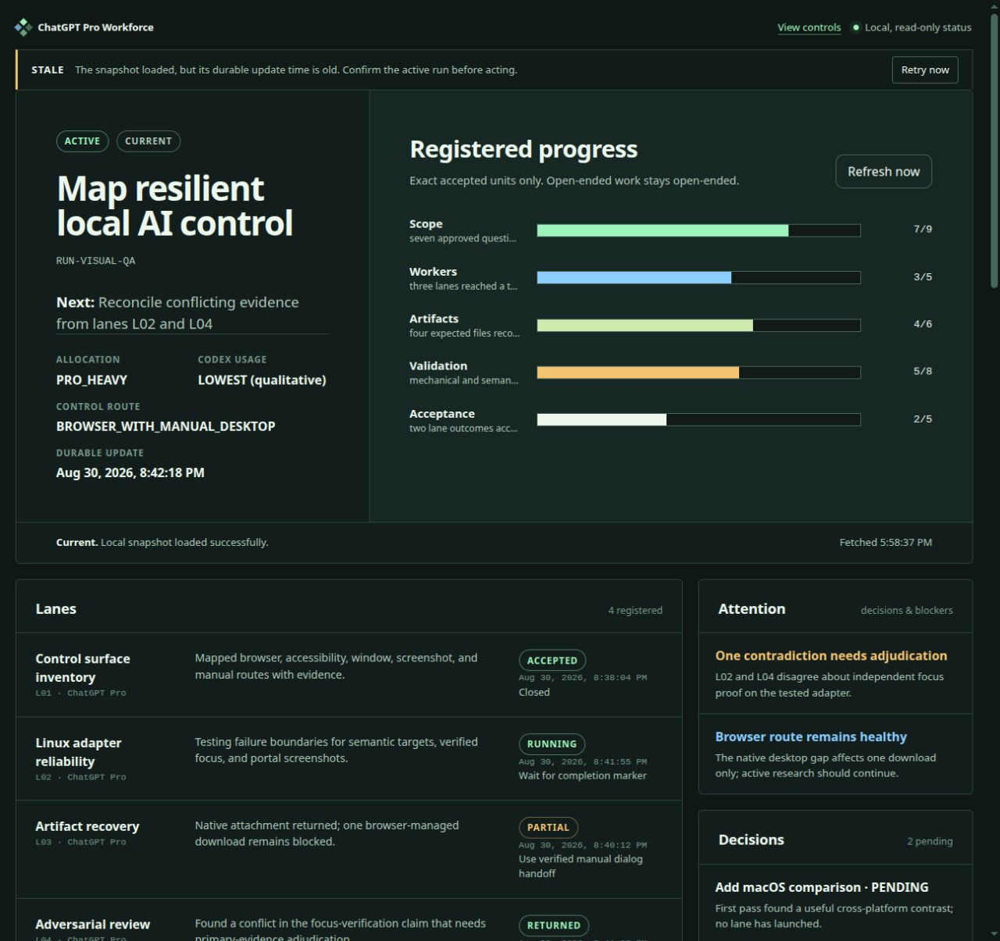

# ChatGPT Pro Workforce for Codex

[](https://github.com/jemo19/chatgpt-pro-workforce/actions/workflows/validate.yml)
[](LICENSE)
[](chatgpt-pro-workforce/SKILL.md)

An evidence-first Codex skill for coordinating ordinary logged-in ChatGPT Pro
browser conversations as bounded external workers. Codex retains responsibility
for scope, permissions, prompts, browser and desktop targeting, artifact
recovery, independent verification, integration, lineage, and final acceptance.

> [!IMPORTANT]
> This is an unofficial community project. It is not affiliated with, endorsed
> by, or maintained by OpenAI. ChatGPT, ChatGPT Pro, and Codex are referenced
> only to describe compatibility and the services the skill coordinates.

## Why use it?

- Turn broad research, review, calculation, synthesis, and artifact work into
  bounded lanes with stable ownership.
- Walk through setup one small question at a time when invoked without a task.
- Verify browser and computer-control readiness before every invocation and
  recheck affected controls when a workflow stalls.
- Preserve raw worker returns, hashes, lane state, decisions, and independent
  acceptance evidence.
- Pause safely at usage limits and resume without blindly duplicating worker
  submissions.
- Track exact progress in chat or through an optional sanitized, loopback-only
  dashboard with detailed status, help, and copyable control intents.
- Recommend an Obsidian vault from bounded metadata evidence, then ask before
  writing research notes or topic folders.



## Install

Ask Codex to use its built-in skill installer:

```text
$skill-installer Install the skill from https://github.com/jemo19/chatgpt-pro-workforce/tree/main/chatgpt-pro-workforce
```

Or run the installed helper directly:

```bash
python3 "${CODEX_HOME:-$HOME/.codex}/skills/.system/skill-installer/scripts/install-skill-from-github.py" \
  --repo jemo19/chatgpt-pro-workforce \
  --path chatgpt-pro-workforce
```

Start a new Codex session after installation so skill discovery refreshes.
See [Installation](docs/installation.md) for manual installation, updates,
validation, and safe removal.

## Start with the guided kickoff

Invoke the skill without a task:

```text
$chatgpt-pro-workforce
```

It will run a read-only readiness gate, then guide you through the outcome,
mode, Pro/Codex allocation, lane plan, concurrency, storage, Obsidian notes,
dashboard policy, reporting cadence, permissions, and acceptance criteria. It
does not launch a worker during intake.

For a concrete request:

```text
$chatgpt-pro-workforce Use two Pro workers in Balanced mode to research the accessibility of this product category. Ask before adding newly discovered topics, keep source-backed Obsidian notes, and enable the on-demand status dashboard.
```

The skill supports research, visual review, code review, document review,
data/calculation, adversarial review, synthesis, and artifact production.

## Safe test run and monitoring

Use synthetic or public information for the first run:

```text
Use $chatgpt-pro-workforce for a disposable test run. Do not use private data or consequential actions. Run the full readiness preflight, guide me through a harmless two-lane research task, enable the on-demand dashboard, show the run ID, and stop at the final acceptance gate so I can inspect the evidence.
```

Useful read-only checks during the run:

```text
$chatgpt-pro-workforce status RUN_ID
$chatgpt-pro-workforce tell me more RUN_ID
```

You can also ask Codex:

```text
Monitor RUN_ID during this active session. Report material state changes, verify browser and computer-control health if progress stalls, and stop for my decision before any new permission, installation, destructive action, or broader target.
```

Monitoring is active-session work, not a permanent background service. The
dashboard polls sanitized local state while it is running; it does not keep the
orchestrator alive after the session ends. See
[Test-run monitoring](docs/test-run-monitoring.md) for the evidence and error
signals to collect.

## Controls

These are conversational intents, not native CLI subcommands:

| Intent | Purpose |
|---|---|
| `$chatgpt-pro-workforce status RUN_ID` | Compact evidence-bound progress |
| `$chatgpt-pro-workforce tell me more RUN_ID` | Detailed lanes, controls, artifacts, gates, and next action |
| `$chatgpt-pro-workforce pause RUN_ID` | Stop new submissions and checkpoint safely |
| `$chatgpt-pro-workforce resume RUN_ID` | Reconcile current state before continuing |
| `$chatgpt-pro-workforce change allocation RUN_ID` | Change future Pro/Codex work ownership |
| `$chatgpt-pro-workforce change concurrency RUN_ID 1` | Change the finite future-launch ceiling |
| `$chatgpt-pro-workforce dashboard troubleshoot RUN_ID` | Verify the exact local page and run one bounded safe repair if needed |
| `$chatgpt-pro-workforce help` | Show modes, controls, safety boundaries, and examples |
| `$chatgpt-pro-workforce uninstall` | Begin exact-target, backup-first removal |

Two simultaneous ChatGPT Pro workers is the safe default. More than two is
high risk: it is likely to increase throttling and can leave chats interrupted,
closed, disconnected, or inaccessible before outputs are recovered. Unsaved or
unverified work may be lost. Higher limits require explicit, current-run,
exact-limit acknowledgment and never cause existing chats to be closed
automatically.

## How responsibility is divided

ChatGPT Pro workers can research, review, calculate, critique, synthesize, and
produce bounded artifacts. They remain untrusted capabilities. Codex owns:

- scope, permission boundaries, prompts, and lane ownership;
- browser/tab/window/focus targeting and attachment checks;
- patient monitoring and non-destructive recovery;
- immutable raw returns, inventories, and SHA-256 lineage;
- separate mechanical and semantic acceptance gates;
- independent verification, bounded repair, integration, and durable handoff.

Read [Operating model](docs/operating-model.md) for the full lane and
conversation model, and [Security and privacy](docs/security-and-privacy.md)
for the trust boundaries.

## Platform support

The central requirement is an authorized, signed-in browser route that can
identify the intended ChatGPT conversation and composer. Desktop control is
used only for actions browser semantics cannot complete.

| Platform | Documented control stack |
|---|---|
| Linux | Signed-in Chrome control, Linux Computer Use MCP, Chrome DevTools MCP, and Playwright-extension MCP are recorded separately; AT-SPI, explicit window targeting, verified-focus input, and screenshots are bounded fallbacks. |
| macOS | Browser control first; Accessibility, Screen Recording, Input Monitoring, and Automation permissions are action-scoped prerequisites when desktop interaction is required. |
| Windows | Browser control first; UI Automation and explicit window/focus checks precede input, while UAC secure-desktop boundaries are preserved. |

Every environment is preflighted rather than assumed. Missing capabilities can
degrade to a browser-only or manual route. The skill never weakens approvals,
sandboxing, browser security, or operating-system security to make automation
easier. See [Platform support](docs/platform-support.md).

## Dashboard

The optional local dashboard is a read-only projection of sanitized durable
state. It provides exact progress ratios, detailed lane state, readiness,
artifacts, decisions, warnings, full help, and copy buttons for chat intents.
It binds only to loopback, serves a dedicated root, rejects unsafe file state,
and exposes no execution or uninstall endpoint. Chrome automation/debugging
bars are treated as variable browser chrome; screenshot work remeasures the
content viewport rather than assuming the outer window dimensions.

See [Dashboard and controls](docs/dashboard-and-controls.md).

## Repository layout

```text
chatgpt-pro-workforce/   Installable Codex skill
docs/                    Public user and architecture guides
tests/                   Dependency-free structural and behavior checks
scripts/                 Public-tree and deterministic release helpers
.github/                 CI, issue forms, and pull-request guidance
```

The runtime skill intentionally contains no README or build reports. Packaging,
community, and test material stays outside the installable directory.

## Validate locally

Python 3.10 or newer is required for the repository checks. Runtime helpers use
only the Python standard library.

```bash
make check
make package
```

The accepted initial release covers 40 installable files, 98 deterministic
behavior cases, 35 forward scenarios, 20 dashboard integration checks, and 15
Obsidian locator checks. Live browser and desktop capabilities are always
reported separately from simulations.

## Contributing and support

Read [CONTRIBUTING.md](CONTRIBUTING.md) before changing runtime behavior.
Security issues and potentially sensitive control failures belong in private
reports; do not paste credentials, browser state, private prompts, or customer
data into a public issue. See [SECURITY.md](SECURITY.md) and
[SUPPORT.md](SUPPORT.md).

## License

Licensed under the [Apache License 2.0](LICENSE).
