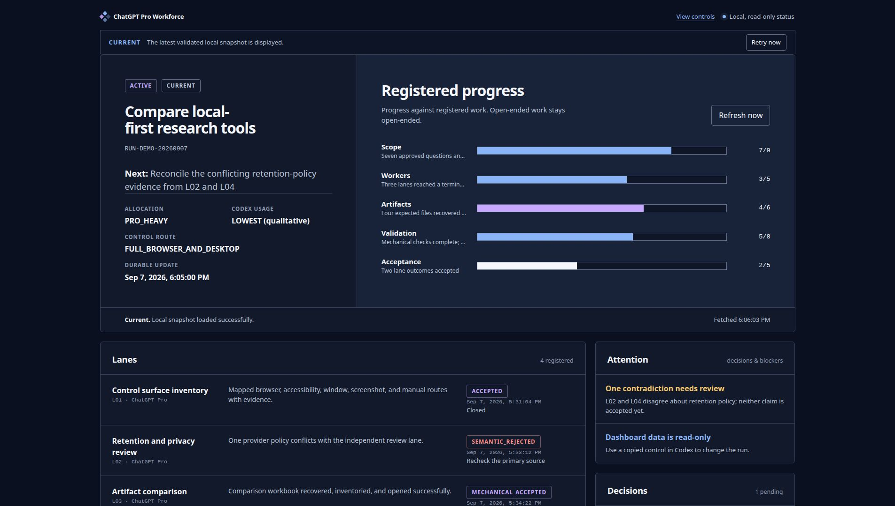
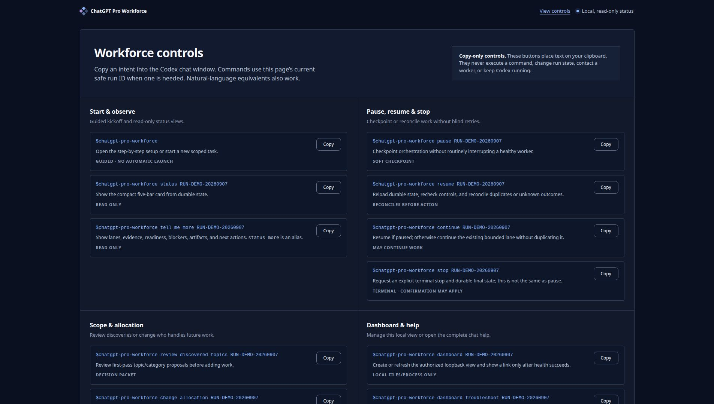

# ChatGPT Pro Workforce for Codex

[](https://github.com/jemo19/chatgpt-pro-workforce/actions/workflows/validate.yml)
[](LICENSE)
[](chatgpt-pro-workforce/SKILL.md)

This Codex skill turns regular, signed-in ChatGPT Pro chats into a small research
crew. It is meant for work that is too large for one long chat and too important
to lose track of halfway through.

Codex runs the job. It splits the work, checks the right account and model before
each prompt, watches the browser, saves what comes back, verifies the result, and
keeps enough state to resume later. ChatGPT Pro handles the research, analysis,
review, calculation, and artifact lanes you give it.

## What it does

- Walks you through setup if you invoke the skill by itself.
- Shows every available choice instead of expecting you to know its internal
  modes or settings.
- Splits a larger job into separate worker chats with clear ownership.
- Checks Chrome and computer-control support before work starts and again each
  time you invoke the skill.
- Rechecks the browser and computer controls if the workflow starts hanging or
  something stops responding.
- Saves the original worker output before repairing or combining anything.
- Tracks files, hashes, sources, decisions, progress, ownership, and the next
  safe action in durable run state.
- Writes a send intent before browser submission, then records what was actually
  observed. That is how it avoids casually resending an uncertain prompt.
- Can pause at usage limits and resume from the saved state.
- Checks that the account has Pro, the intended model is selected, and thinking
  power reads `Pro, 5 of 5` before every worker prompt. An account badge, a
  collapsed `Pro` button, or `High` does not pass that check.
- Can keep research notes in an Obsidian vault after it finds likely vaults and
  confirms the location with you.
- Can use more ChatGPT Pro and less Codex, or the other way around. You can
  change that setting later.
- Includes a local, read-only status page with progress, worker state, problems,
  controls, and copy buttons.
- Can turn an accepted research run into one searchable HTML file for reading,
  filtering, source tracing, and printing without a server or internet
  connection.

## See the run while it is working

The dashboard is local to your computer. It does not send status data to a
separate service, and the buttons only copy commands back to Codex.

The first screen shows the run, what should happen next, and five separate
progress measurements. Scope, workers, artifacts, validation, and acceptance
stay separate because they do not always move at the same speed.

[](docs/images/dashboard-overview-v1.2.jpg)

The lower part of the page has the full control list. Copy the command you want
and paste it into Codex; the page itself cannot execute anything.

[](docs/images/dashboard-controls-v1.2.jpg)

If the page loses its local connection, it keeps the last good information on
screen, says that it is reconnecting, and retries. If that does not fix it, use:

```text
$chatgpt-pro-workforce dashboard troubleshoot RUN_ID
```

That checks the server instance, run page, run ID, HTML shell, and status file.
It can restart one verified skill-owned dashboard process. It will not kill an
unknown process that happens to own the same port.

More details: [Dashboard and controls](docs/dashboard-and-controls.md)

## Read the finished research as a page

Research runs can also produce a self-contained HTML explorer after the work
has passed review. Open it like a normal file. It keeps the summary, findings,
sources, contradictions, limitations, recommendations, and accepted artifact
list together, with search and filters built in.

It does not call a server, load a CDN, track you, or fetch sources in the
background. The underlying accepted files and source notes still remain the
record; the explorer is the easier way to read and move through them.

More details: [Research explorer](docs/research-explorer.md)

## What you need

At minimum:

- Codex with user skills enabled;
- a ChatGPT Pro account already signed in through Chrome;
- the Codex Chrome control extension working with that browser.

For work outside the browser, the skill checks the computer-control options
available on the current operating system.

| Platform | What the skill looks for |
|---|---|
| Linux | Chrome control, Linux Computer Use MCP, Chrome DevTools MCP, and the Playwright extension. AT-SPI and explicit window/focus checks are used before input. |
| macOS | Browser control first, then Accessibility, Screen Recording, Input Monitoring, and Automation permissions when the task actually needs them. |
| Windows | Browser control first, then UI Automation and verified window/focus handling. It does not bypass UAC or the secure desktop. |

Missing support does not automatically end the job. The skill can offer setup,
use a browser-only route, hand a desktop step to you, or revise the workload.
It asks before installing tools, changing permissions, or doing anything with a
larger security impact.

Before a Pro worker prompt is sent, the skill opens and reads the model and
thinking-power controls on that exact conversation. If needed, it can select
the intended model and maximum power through an already-authorized semantic
browser action, close and reopen the selector, and verify `Pro, 5 of 5`. If the
UI is ambiguous, Pro is unavailable, or ChatGPT has fallen back because of a
limit, the prompt is not sent and the skill tells you what needs attention.

See [Platform support](docs/platform-support.md) for the longer version.

## Install

The recommended way is to ask Codex to use its built-in skill installer:

```text
$skill-installer Install the skill from https://github.com/jemo19/chatgpt-pro-workforce/tree/main/chatgpt-pro-workforce
```

You can also run Codex's installed helper directly:

```bash
python3 "${CODEX_HOME:-$HOME/.codex}/skills/.system/skill-installer/scripts/install-skill-from-github.py" \
  --repo jemo19/chatgpt-pro-workforce \
  --path chatgpt-pro-workforce
```

Start a new Codex session after installing it so the skill list refreshes.

The installer uses `$CODEX_HOME/skills` (normally
`$HOME/.codex/skills`). If your Codex configuration uses the shared
user-scoped root at `$HOME/.agents/skills`, pass it explicitly:

```bash
python3 "${CODEX_HOME:-$HOME/.codex}/skills/.system/skill-installer/scripts/install-skill-from-github.py" \
  --repo jemo19/chatgpt-pro-workforce \
  --path chatgpt-pro-workforce \
  --dest "$HOME/.agents/skills"
```

Keep one active copy. Two discoverable copies with the same skill name make
updates and troubleshooting needlessly confusing.

For manual installation, updates, validation, and removal, see
[Installation](docs/installation.md).

## First run

Start with just the skill name:

```text
$chatgpt-pro-workforce
```

It will ask one question at a time and show the available choices as a lettered
list. The setup covers:

- what you are trying to get done;
- research, review, calculation, synthesis, or artifact mode;
- how much work ChatGPT Pro should do versus Codex;
- whether it may suggest or add newly discovered research topics;
- how many Pro workers may run at once;
- how often you want updates;
- where downloaded files should go and when they may be cleaned up;
- whether you want Obsidian notes and where they should live;
- whether the local dashboard should be off, on demand, or enabled;
- whether accepted research should always get an interactive HTML explorer,
  be offered one at the end, or skip it;
- browser, desktop-control, and permission readiness;
- what you want back at the end and how thoroughly it needs to be checked.

It shows you the final setup before launching workers.

For a direct request, you can include the choices up front:

```text
$chatgpt-pro-workforce Research local-first AI note tools with two ChatGPT Pro workers. Use Pro-heavy mode, ask me before adding new topics, save source-backed notes in Obsidian, and turn on the dashboard.
```

## Pro versus Codex usage

You can change this at any time. Changes apply to new work so an active worker
does not suddenly change owners halfway through a task.

| Setting | How the work is split | Codex usage |
|---|---|---|
| Pro-heavy | ChatGPT Pro does most research, drafting, analysis, and artifact work. Codex orchestrates and checks it. | Lowest |
| Balanced | ChatGPT Pro and Codex share the substantive work. | Moderate |
| Codex-heavy | Codex does most of the work and uses Pro for specialist or independent review. | High |
| Local only | No ChatGPT Pro workers are launched. | Codex only |

## Worker limits

Two simultaneous ChatGPT Pro workers is the safe default.

Going over two is much more likely to cause throttling, interrupted chats, closed
tabs, disconnected sessions, or work that cannot be recovered. The skill warns
you and requires an explicit limit for that run before it launches more than
two. It never closes an existing chat just to make room for another one.

## Useful controls

These are instructions you paste into Codex. They are not shell commands.

| What you want | Command |
|---|---|
| Start the walkthrough | `$chatgpt-pro-workforce` |
| Quick status | `$chatgpt-pro-workforce status RUN_ID` |
| Full status and evidence | `$chatgpt-pro-workforce tell me more RUN_ID` |
| Pause new work and save the current state | `$chatgpt-pro-workforce pause RUN_ID` |
| Check the saved state and continue | `$chatgpt-pro-workforce resume RUN_ID` |
| Continue an existing active or paused run | `$chatgpt-pro-workforce continue RUN_ID` |
| Stop a run and record a terminal state | `$chatgpt-pro-workforce stop RUN_ID` |
| Review topics found during the first pass | `$chatgpt-pro-workforce review discovered topics RUN_ID` |
| Change future Pro/Codex work | `$chatgpt-pro-workforce change allocation RUN_ID` |
| Change the future worker limit | `$chatgpt-pro-workforce change concurrency RUN_ID` |
| Open or refresh the dashboard | `$chatgpt-pro-workforce dashboard RUN_ID` |
| Diagnose a dashboard that will not load | `$chatgpt-pro-workforce dashboard troubleshoot RUN_ID` |
| Stop the verified dashboard process | `$chatgpt-pro-workforce dashboard stop RUN_ID` |
| Build or recheck the accepted research page | `$chatgpt-pro-workforce export explorer RUN_ID` |
| Show all controls and examples | `$chatgpt-pro-workforce help` |
| Start the guided removal process | `$chatgpt-pro-workforce uninstall` |

## Pause, limits, and recovery

The skill keeps a run ID, worker IDs, prompt hashes, browser conversation
identity, file hashes, and the next safe action in local state. On resume it
checks what actually happened before submitting anything again.

On Linux, the bundled state helper enforces the write order with a private
SQLite ledger and file lock. On macOS, Windows, or a Linux machine where that
preflight fails, the skill uses one-writer, immutable, hash-chained revisions.
If it cannot verify the owner and durable commit, it will not automate another
browser send.

It treats these situations differently:

- work that is healthy but slow;
- a temporary ChatGPT or browser error;
- a stalled worker;
- disconnected browser control;
- an incomplete final response;
- a response that returned only part of the expected files.

It does not use reloads, duplicate prompts, “answer now,” or random clicking as
normal monitoring tools.

The dashboard is not a background worker. Codex still has to be running to
orchestrate and report new state. See
[Test-run monitoring](docs/test-run-monitoring.md).

## Downloads and Obsidian notes

During first setup, the skill asks whether worker downloads should use a
separate folder and whether old run-owned files may be cleaned up later. It does
not perform broad cleanup in Downloads. Its helper checks the exact path and
hash again, then moves approved bytes into private run-owned quarantine. It
does not permanently purge them.

For Obsidian, it checks configured and likely vault locations without reading
your note contents. It suggests the best match and asks you to confirm it. Each
research topic can get its own folder with the run state, sources, findings, and
links to native artifacts. Large files are indexed instead of copied into the
vault again.

## What Codex still has to do

ChatGPT Pro workers are useful, but their answers are not automatically trusted.

Codex is still responsible for:

- the scope and permission boundaries;
- worker prompts and ownership;
- the correct browser tab, window, and file attachment;
- saving the original returned files;
- checking files, hashes, links, and expected output;
- checking whether the actual content is correct;
- resolving disagreements between workers;
- combining the accepted work;
- the final answer and handoff.

See [Operating model](docs/operating-model.md) and
[Security and privacy](docs/security-and-privacy.md).

## Test it without risking real work

For the first run, use public or disposable information:

```text
Use $chatgpt-pro-workforce for a disposable test. Walk me through a harmless two-worker research task, turn on the dashboard, show me the run ID, and stop at the final review so I can inspect everything before accepting it.
```

The repository checks the skill structure, links, setup flow, durable run
state, pause/resume logic, duplicate submissions, artifact intake and cleanup,
unsafe ZIP handling, dashboard security and recovery, the offline explorer,
Obsidian discovery, and the documented platform routes.

Run the checks with:

```bash
make check
make verify-package
```

Python 3.10 or newer is required for repository checks. The runtime helpers use
the Python standard library and do not download dependencies.

## Repository layout

```text
chatgpt-pro-workforce/   The installable skill
docs/                    User guides and design notes
tests/                   Behavior, forward, dashboard, and locator tests
scripts/                 Packaging and public-tree checks
.github/                 GitHub Actions and contribution templates
```

## Contributing and support

Read [CONTRIBUTING.md](CONTRIBUTING.md) before changing runtime behavior.

Do not post credentials, browser state, private prompts, customer information,
or private research files in a public issue. Use [SECURITY.md](SECURITY.md) for
security reporting and [SUPPORT.md](SUPPORT.md) for normal help.

## License

Licensed under the [Apache License 2.0](LICENSE).
